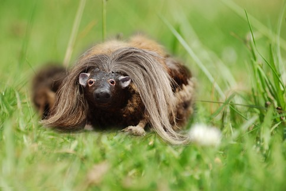

### Haggis population density in the Scottish Highlands
#### S. Johnston

```{r echo = F, results = "hide"}
# Load libraries and data files

library(ggplot2)

hds <- read.table("data/haggis_density.txt", header = T)
head(hds)

hds <- rbind(hds, data.frame(Year = c(2001, 2002),
                             PopSize = c(868, 890)))


# Conduct a linear regression of Population Size by Year

fit1 <- lm(PopSize ~ Year, data = hds)

# What is the slope?

fit1$coefficients

slope <- fit1$coefficients[2]
slope

# What is the P-value?

summary(fit1)$coefficients

pval <- summary(fit1)$coefficients["Year", "Pr(>|t|)"]
pval
```


The haggis is a common pest species in the Scottish Highlands (Figure 1). Haggis population densities were recorded annually from ```r min(hds$Year)``` to ```r max(hds$Year)```. We found that the haggis population size increased over this period by ```r slope``` individuals year-1 (P ```r ifelse(pval < 0.001, "< 0.001", paste("=", pval))```, Figure 2).

 


Figure 1. A wild haggis (Photo: StaraBlazkova, Wikimedia Commons)
 
 
```{r echo = F, fig.width = 3, fig.height = 3}
# Plot the regression

ggplot(hds, aes(Year, PopSize)) +
  geom_point() + 
  stat_smooth(method = "lm")
```

Figure 2: Linear regression of haggis population size and year. 

